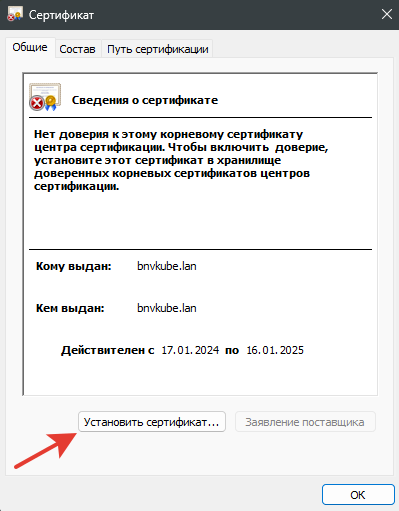
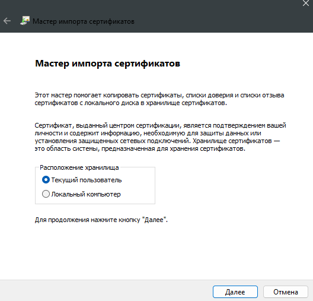
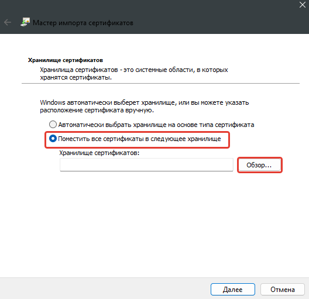
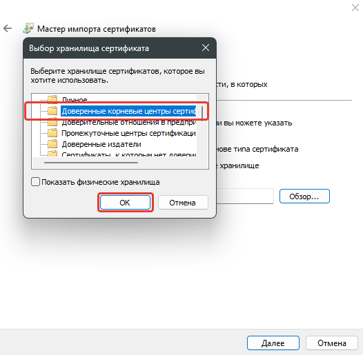
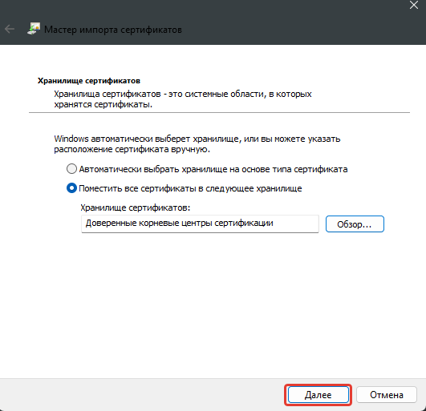
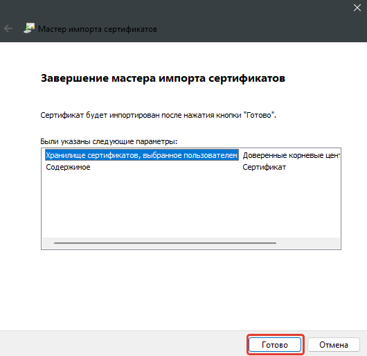
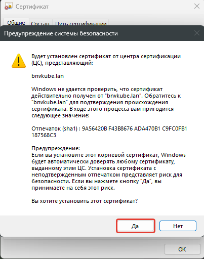
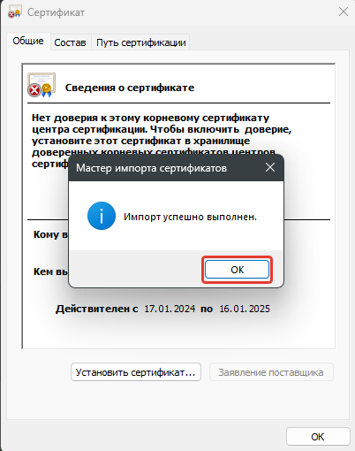
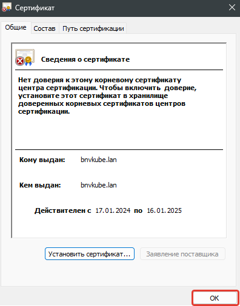

[[Перейти в начало](../README.md)]

---

## Настройка Cert Manager

* [Установка Cert Manager](../install-cert-namager/README.md)   
* [Self-Signed сертификат](#автоматическое-создание-self-signed-сертификата)
* [Let's Encrypt сертификат](#автоматическое-создание-сертификата-подписанный-lets-encrypt--не-тестировал-)


### Автоматическое создание Self-Signed сертификата

1. Создаем папку для сертификата, переходим в нее
   ```bash
   mkdir -p ~/kube-config/kube-cert-manager && cd ~/kube-config/kube-cert-manager
   ```

2. Создаем закрытый ключ CA
   ```
   openssl genrsa -out ca.key 4096
   ```

3. Создаем сертификат CA на 365 дней
   ```
   openssl req -new -x509 -sha256 -days 365 -key ca.key -out ca.crt
   ```

4. Создаем секрет self-signed-tls.yaml
   ```bash
   kubectl create secret tls self-signed-tls -n cert-manager --cert=./ca.crt --key=./ca.key
   ```

5. Создаем cluster issuer [00-cluster-issuer.yaml](./00-cluster-issuer.yaml)
   ```yaml
   apiVersion: cert-manager.io/v1
   kind: ClusterIssuer
   metadata:
     name: self-signed
   spec:
     ca:
       secretName: self-signed-tls
   ```
   ```bash
   kubectl apply -f ./00-cluster-issuer.yaml
   ```   

   *Если мы будем использовать наш созданный self-signed ClusterIssuer в Ingress, то будут создаваться сертификаты, которые будут подписаны нашим сертификатом, то есть мы выступаем в роли центра сертификации*

---

Что бы в ваша система не ругалось на то, что сертификат не доверенный, его надо добавить в раздел **"доверенные корневые центры сертификации"**

1. Скачиваем созданный **ca.crt**
   ```bash
   scp bnviking@192.168.1.12:/home/bnviking/kube-config/kube-cert-manager/ca.crt ./
   ```
   
2. Устанавливаем **ca.crt** *(двойной клик в windows)*

   
   
   
   
   
   
   
   
   
   
   
   
   
   
   
   
   

---

Пример использования в Ingress
   ```yaml
   apiVersion: networking.k8s.io/v1
   kind: Ingress
   metadata:
      name: test-ingress
      namespace: default
      labels: {}
      annotations:
         cert-manager.io/cluster-issuer: self-signed #Указываем наш ClusterIssuer
   spec:
      tls:
         - hosts:
              - name.bnvkube.lan
           secretName: tls-secret #Может быть задано любое имя для нашего сертификата
   ```
---

Пример создания сертификата, с помощью self-signed ClusterIssuer
```yaml
apiVersion: cert-manager.io/v1
kind: Certificate
metadata:
  name: nginx-cert
  namespace: nginx
spec:
  secretName: nginx-tls-secret
  issuerRef:
    name: self-signed #Указываем наш ClusterIssuer
    kind: ClusterIssuer
  dnsNames:
    - nginx.bnvkube.lan
```
---

### Автоматическое создание сертификата подписанный Let's Encrypt (не тестировал)

* Основной сервер
```
https://acme-v02.api.letsencrypt.org/directory
```
* Тестовый сервер
```
https://acme-staging-v02.api.letsencrypt.org/directory
```

*Let's Encrypt имеет ограничение на количество выпускаемых сертификатов, поэтому для отладки и экспериментов рекомендуется использовать не основной сервер*

Шаблон для создания ClusterIssuer Let's Encrypt
   ```bash
   cat <<EOF | kubectl apply -f -
   apiVersion: cert-manager.io/v1
   kind: ClusterIssuer
   metadata:
     name: CI_NAME
   spec:
     acme:
       email: EMAIL_ADDRESS
       server: SERVER
       privateKeySecretRef:
         name: PRIVATE_KEY
       solvers:
       - http01:
          ingress:
            class: nginx
   EOF
   ```
* CI_NAME - Наименование нашего ClusterIssuer
* EMAIL_ADDRESS - Ваш email (он должен быть реальным)
* PRIVATE_KEY - Имя приватного ключа

*Можно создать 2 копии ClusterIssuer, для тестового сервера и для основного*

---

Просмотр всех ClusterIssuer
```bash
kubectl get clusterissuer -o wide
```
```
NAME          READY   STATUS                AGE
self-signed   True    Signing CA verified   34m
```

---

[[Перейти в начало](../README.md)]