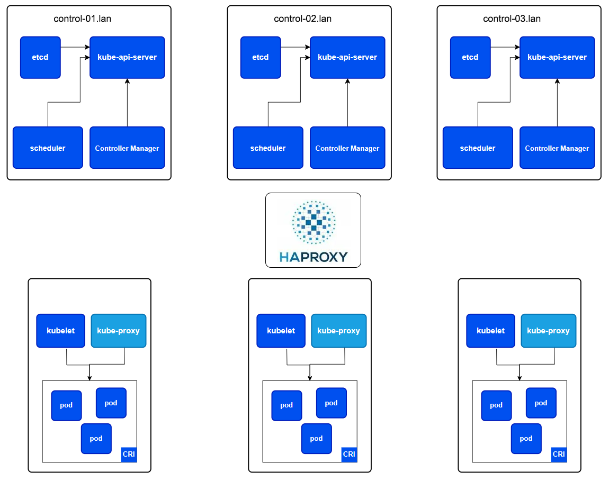

[[Перейти в начало](../../README.md)]

---

## Создание виртуальных машин
Перед созданием узлов, необходимо скопировать свой **ssh** ключ
   ```
   ssh-copy-id username@192.168.1.11
   ```
Клонируем эталонный узел [[Подготовка узла](../00-preparing-machine/README.md)] 6 раз.



*ПС: В вашей сети для каждого узла должен быть назначен статический IP адрес и DNS (привязка IP по имени хоста)*

Список узлов (3 узла для роли Control Plane и 3 узла Worker):

```yaml
   192.168.1.12:   control-01.lan;
   192.168.1.13:   control-02.lan;
   192.168.1.14:   control-03.lan;
   192.168.1.15:   worker-01.lan;
   192.168.1.16:   worker-02.lan;
   192.168.1.17:   worker-03.lan;
```

### Настройка каждого узла

1. Меняем имя хоста, на привязанный в DNS
    ```bash
    echo "control-01.lan" | sudo tee /etc/hostname;
    ```

2. Генерируем ssh ключ
    ```bash
    ssh-keygen;
    ```
3. Если ключ ssh не скопирован, то копируем его
   ```bash
   nano ~/.ssh/authorized_keys;
   ```
4. Автодополнение для команд kubectl в bash
   ```
   source <(kubectl completion bash);
   echo "source <(kubectl completion bash)" >> ~/.bashrc;
   ```

5. Перезагружаем
    ```bash
    sudo reboot;
    ```

---

[[Перейти в начало](../../README.md)]